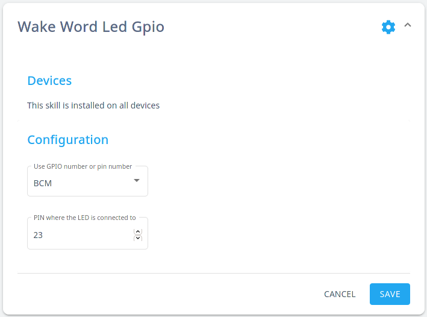

#  Wake Word GPIO LED

A light *(LED)* indicator for Mycroft on Raspberry Pi

## About

The [Raspberry Pi](https://rapsberrypi.org) is a tiny and affordable computer that you can use to interact with `GPIO` _(General Purpose Input/Output)_ such as button, sensor, LED, etc...

This skill interacts with a LED to let you know if Mycroft is listening. When a wake word is detected the LED is turning on and when the recording is done the LED is turning off.

## Examples

There is no example because there is no interaction with the Mycroft.

## Installation

Make sure to be within the Mycroft `virtualenv` before running the `msm` command.

```
$ . mycroft-core/venv-activate.sh
$ msm install https://github.com/smartgic/mycroft-wakeword-led-gpio.git
```

## Configuration

This skill utilizes the `settings.json` file which allows you to configure this skill via `home.mycroft.ai` after a few seconds of having the skill installed you should see something like below in the https://home.mycroft.ai/#/skill location:



Fill this out with your appropriate information and hit save.

## Credits

Smart'Gic

## Category

**IoT**

## Tags

#wakeword
#raspberrypi
#led
#gpio
#smarthome
